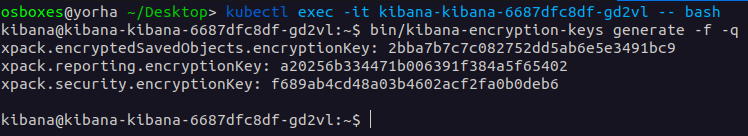
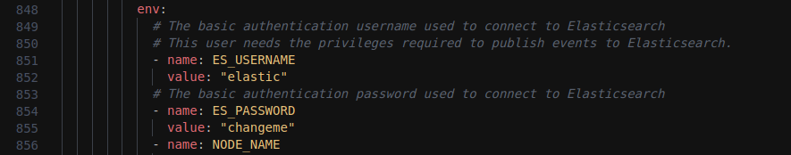

# Deploy with Helm

## Install ElasticSearch

```
helm repo add elastic https://helm.elastic.co
helm repo update
helm install elasticsearch elastic/elasticsearch -f elasticsearch.yaml
```

## Install Kibana

```
helm install kibana elastic/kibana -f kibana.yaml
```

Accessing Kibana by following URL:

```
http://{Node_IP}:{Kibana_Port}
```


### Generate Kibana encryption key

If you want to use the some features of Kibana, such as **Webhook** connector, you need to generate a new encryption key for Kibana.

```
kubectl exec -it {kibana-pod-name} -- bash
```

You can generate a new encryption key by running the following command:
    
```
bin/kibana-encryption-keys generate -f -q
```

<p align="center">
  
</p>

## Uninstall Kibana

If you want to uninstall Kibana, you can completely remove it by running the following commands:

```
helm uninstall kibana
kubectl delete configmap kibana-kibana-helm-scripts
kubectl delete serviceaccount pre-install-kibana-kibana
kubectl delete serviceaccount post-delete-kibana-kibana
kubectl delete roles pre-install-kibana-kibana
kubectl delete rolebindings pre-install-kibana-kibana
kubectl delete job pre-install-kibana-kibana
kubectl delete job post-delete-kibana-kibana
kubectl delete secrets kibana-kibana-es-token
```

## Install K8s Agent

You can follow the instructions when adding Elastic Agent from Kubernetes integration in Kibana or using the existing manifest file to deploy the Elastic Agent.

Before deploying the K8s Agent, you need to edit the manifest file. There are 3 places that need to be modified:

* **host**: The host of ElasticSearch. The URL format is **https://{ElasticSearch_Service_IP}:{ElasticSearch_Port}**

* **ssl.verification_mode**: The verification mode of SSL.

> **Note**: If you are using default certificate that is generated by ElasticSearch, you need to set the value of ***ssl.verification_mode*** to ***none***.

<p align="center">
  
</p>

&nbsp;

* **password**: The password of the ***elastic*** user in ElasticSearch.

<p align="center">
  
</p>

After editing the manifest file, you can deploy the K8s Agent by running the following command:

```
kubectl apply -f k8s-agent.yaml
```